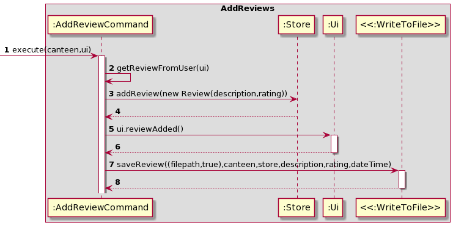
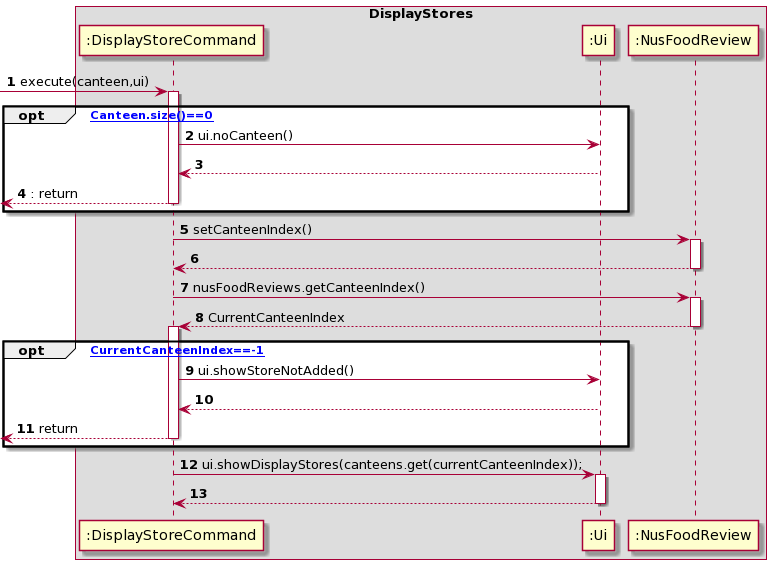
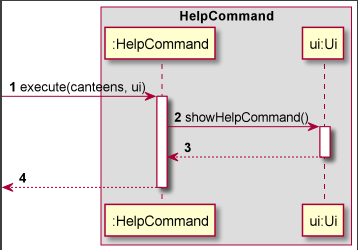
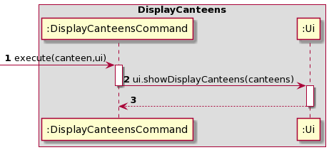
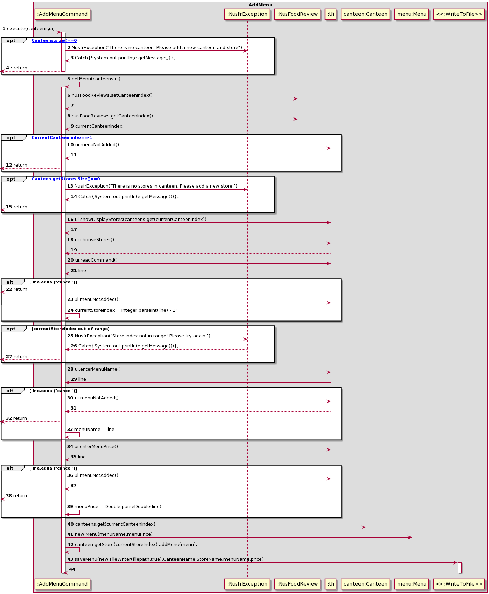
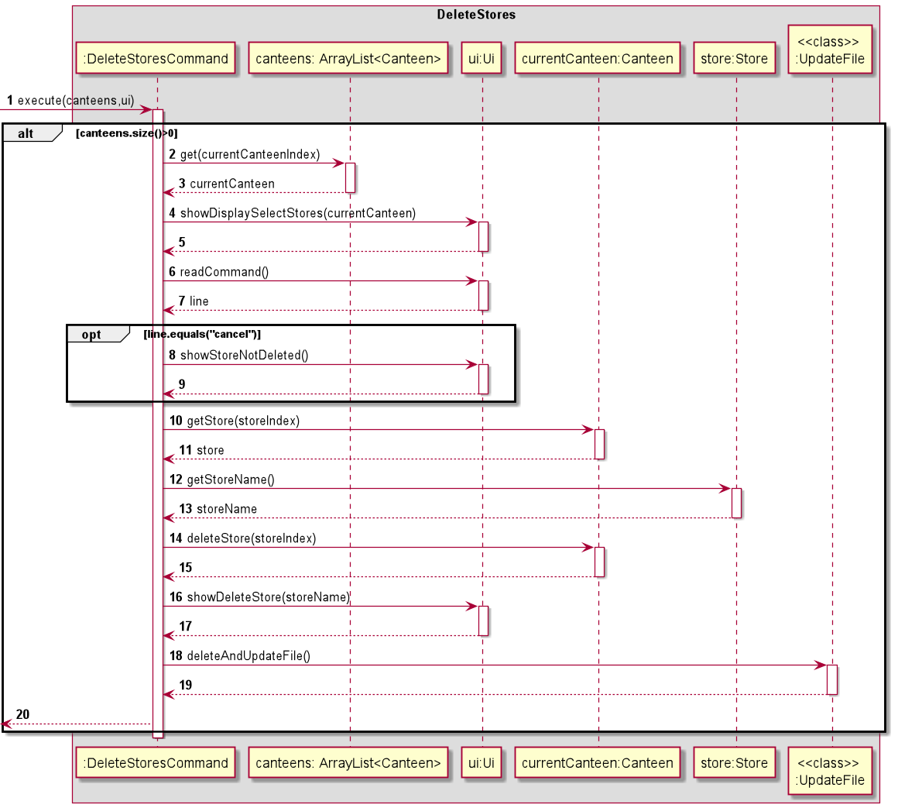
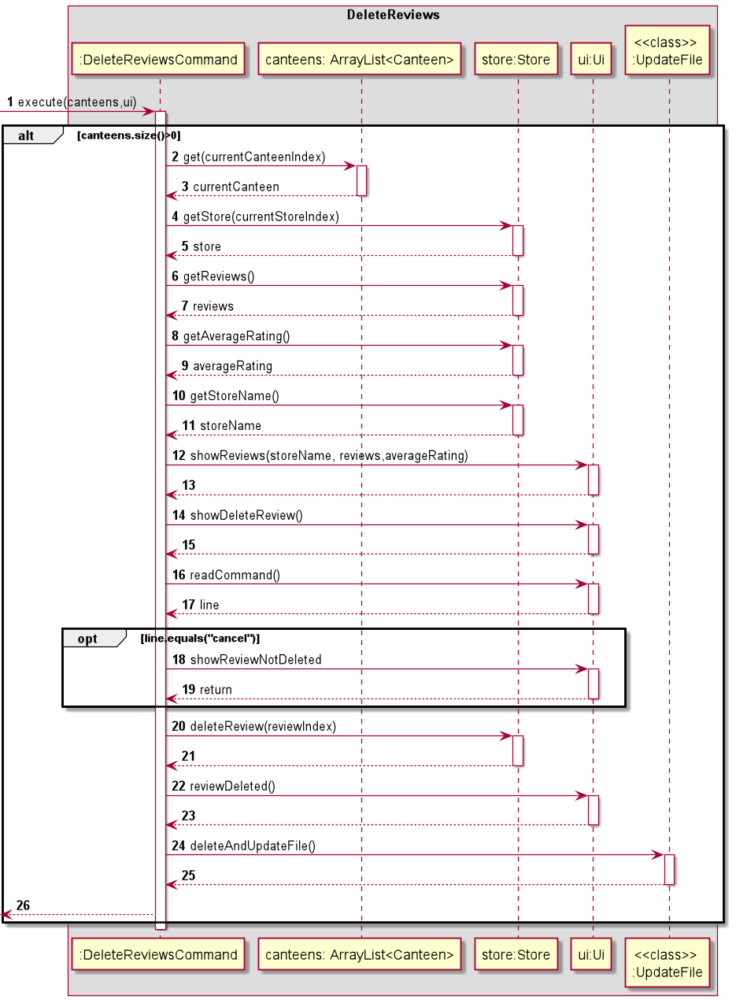

# Developer Guide 

## Table of Contents
* [Setup](#setup)
    * [Prerequisites](#prerequisites)
    * [Get Started](#getting-started)
* [Design](#design)
    * [Project Overview](#project-overview)
    * [Architecture](#architecture)
    * [Logic Component](#logic-component)
    * [Model Component](#model-component)
    * [Storage Component](#storage-component)
*  [Implementation](#implementation)
    * [Main](#main)
    * [Public User](#public-user)
    * [Admin User](#admin-user)
   

## **Setup**
### Prerequisites
+ *JDK `11`* or beyond.
+ Permission rights to create a file and folder in your machine.
+ At least 10Mb of free space on disk.

### Getting-started
1. Fork this repo and clone it into your computer.
2. Run Intellij as your IDE (Highly Recommended).
3. Configure the JDK to JDK 11.
4. Make sure you have added the following plugins, if disable please re-enable it back by going to `File`>`Settings`>`Plugins`.
   
5. Import the project as a Gradle project by selecting build.gradle. 
6. Verify the setup: Run the nusfoodreviews and test a few commands. 
7. Run the gradle Checks and Tests to ensure they all pass.

## **Design**
### Project-Overview
NusFoodReviews is an application that is built using Java. It has cross-platform ability and is able to run on MAC-OS, 
Windows and Linux. When run, NusFoodReviews allows user to view selected canteens, stores with their menus, reviews and ratings. In addition,
user is able to leave reviews and ratings to the stores. On the other hand the user can choose to run as admin, and the
password is `Password`. When run as admin the user is able to `add` or `remove` canteens, stores, menu and reviews. These admin
functions allows the app to be moderated and maintained by the person in charge. 

### Architecture

The Architecture Diagram shown above explains the high-level design of NusFoodReviews Application. The following is a brief overview of each component.

`Main` is responsible for,
+ At app launch: Initializes the components in the correct sequence, and connects them up with each other.
+ At shut down: Shuts down the components and invokes cleanup methods where necessary.

`Resources` contains the bundled resource(database file) of the application. When user run the application for the first time, 
it will read from this resource and copy it to the local machine. Return user will not need to read from this resource anymore. 

`Commons` represents a collection of classes used by multiple other components.
  

  
The rest of the App consists of four components.
* [**`UI`**]: The UI of the App. 
* [**`Logic`**](#logic-component): The command executor.
* [**`Model`**](#model-component): Holds the data of the In-App memory.
* [**`Storage`**](#storage-component): Reads data from text file, and write to text file. 

### Logic-Component

### Model-Component

### Storage-Component

The `Storage` component,
* For new user, will first create a new directory and text file.
* Next, will load the data from resource and write it into the newly created text file.
* At the same time, it will also load into the in-app data.
* If it is an existing user, it will only loads data from the text file into in-App data.  

## **Implementation** 
This section describes some noteworthy details on how certain features are implemented.

There are 2 types of user :
+ [**`Public User`**](#public-user)
+ [**`Admin User`**](#admin-user)

### Main

When the application is launched, an Ui object and Parser object is instantiated.
To instantiate the Parser object, the main NusFoodReviews and Ui object is passed.

### Public User
For public users, the list of commands is shown below:

* Display selected store sample menu: [**`menu`**](#display-menu) 
* Display all reviews of the selected store : [**`reviews`**](#display-reviews)
* Add a new review of the selected store: [**`add`**](#add-reviews)
* Goes back to home page to select canteen: [**`home`**](#home)
* Display all the stores of the selected canteen: [**`list`**](#list)
* Goes back to login page: `login` (not worthy)
* Exiting the application: `exit`(not worthy)

### Display Menu

To display menus, `DisplayMenusCommand.execute()` is called, passing in
an ArrayList of canteens and the Ui object instantiated in NusFoodReviews.

When DisplayMenusCommand was first instantiated, the relevant Store object was passed
into the constructor. `DisplayMenusCommand.execute()` will then call `getMenus()` on the
store object to get an ArrayList of menus, before passing the ArrayList to the ui object
to be displayed by calling `Ui#showDisplayMenu()`.

### Display Reviews

To read reviews, `ReadReviewsCommand.execute()` is called passing in an ArrayList of
canteens and the Ui object instantiated in nusFoodReviews.

When ReadReviewsCommand was first instantiated, the relevant Store object was passed
into the constructor. `ReadReviewsCommand.execute()` will then call `getReviews()` on the
store object to get an ArrayList of reviews, then calling `getAverageRating()` to get the
average rating of the store. After that, `getStoreName()` is also called to get the store
name of the store. These parameters are then passed to the ui object to be displayed by calling
`ui.showReviews()`

### Add Reviews

To add reviews, `AddReviewCommand.execute()` is called passing in an ArrayList of
canteens and the Ui object instantiated in nusFoodReviews.

`AddReviewCommand.execute()` will then call `getReviewFromUser(ui)` to get the description and rating. Next, it will 
then create a new review object and add it into Store by calling `store.addReview(Review)`. Lastly, it will call
`saveReview((filepath,true),canteen,store,description,rating,dateTime)` by instantiating the class `WriteToFile` to 
save the new review into the text file database.

### Home 

To reset the store and canteen index in nusFoodReviews, `HomeCommand#execute()` is called,
passing in an ArrayList of canteens, and the ui object instantiated in NusFoodReviews.

When `HomeCommand` is first called, we pass the main NusFoodReviews object to the
constructor. This allows the `Command` to interact with the main object when `execute` is called.

### List

To see the list of stores in a canteen, `DisplayStoreCommand.execute()` is called passing in an ArrayList of
canteens and the Ui object instantiated in nusFoodReviews.

First thing, if canteen size is 0 the command will be ended telling the user that there is no canteen no view.
Next, if there are canteens available then user will choose one of the canteen by calling `NusFoodReviews.setCanteenIndex`.
After choosing it will call `nusFoodReviews.getCanteenIndex()` to get the canteen's index to view its stores. If canteen's
index is -1, it means that user input is cancel and it will return from that function. Lastly, `ui.showDisplayStores(canteens.get(currentCanteenIndex))` 
will be called to display the list of stores in the chosen canteen.

### Help Command

Help command is  used to showcase the user all the available commands and respective descriptions about what the
commands are all about. HelpCommand#execute is called, passing in an ArrayList of
canteens, and the ui object instantiated in NusFoodReviews.

To reset the store and canteen index in nusFoodReviews, HomeCommand#execute() is called, passing in an ArrayList of
canteens, and the ui object instantiated in NusFoodReviews.

### Admin User

For an admin user, the list of commands is shown below:

* View canteens [**`1`**](#view-canteens)
* Add canteen [**`2`**](#add-canteen)
* Add a store in a canteen [**`3`**](#add-store)
* Add Menu to a store [**`4`**](#add-menu)
* Delete canteen [**`5`**](#delete-canteen)
* Delete a store in a canteen [**`6`**](#delete-stores)
* Delete reviews in a store [**`7`**](#delete-reviews)
* Delete menu in a store [**`8`**](#delete-menu)
* View stores in a canteen [**`9`**](#list) (same as public user)
* Exit `0`(Not worthy)

### Run as admin

Once admin is verified in NusFoodReviews, The program will start asking for inputs and `Parser#parseAdminCommand()` will be
taking in these input and create commands object for admin user to execute. 

### View Canteens

To see the list of canteens, `DisplayCanteensCommand.execute()` is called passing in an ArrayList of
canteens and the Ui object instantiated in nusFoodReviews.

It will then call `ui.ShowDisplayCanteens(canteens)` by passing over the arraylist of canteens.

### Add Canteen

To add a canteen, `AddCanteenCommand#execute()` is called, passing in an ArrayList of canteens and the Ui object instantiated in NusFoodReviews.

`Ui#showAddCanteen()` is called to display the add canteen prompt. The program will then wait for user input, looping continuously if a valid Canteen name is not entered. Invalid names include: existing canteen names. If the user inputs 'cancel', the loop is exited and the program returns from AddCanteenCommand.

Once a valid CanteenName is entered, a new Canteen object is instantiated and added to the ArrayList of canteens. Ui#showAddCanteenSuccess() is then called to display canteen added confirmation.

Additionally, the static method WriteToFile#saveCanteen() is called to update the canteen in storage.

### Add Store

To add a store, `AddStoreCommand#execute()` is called, passing in
an ArrayList of canteens and the Ui object instantiated in NusFoodReviews.

A new Store object is then instantiated, and added to the Canteen's ArrayList of stores.
`Ui#printStoreAdded()` is called to display store added confirmation.

### Add Menu

This is the longest diagram amongst all the others because `menu` is the deepest element. Canteen -> Store -> Menu.
To add a canteen, `AddCanteenCommand#execute()` is called, passing in an ArrayList of canteens and the Ui object instantiated in NusFoodReviews.
First, it will check if there are canteens available. Next, it will check if there are stores in the canteen. Then if both are
checked and valid it will ask user to choose a canteen and store. Then it will ask user to input menu description and price.
It will again check if the price entered is number. If all is passed it will then add this menu to the store. Lastly it will
then append to the data text file. In between it will check if user enters `cancel`. If yes, it will terminate the command.

### Delete Canteen

To delete a canteen, `DeleteCanteenCommand#execute()` is called, passing in
an ArrayList of canteens and the Ui object instantiated in NusFoodReviews.

The program first checks if the ArrayList of canteens has more than 0 canteens.
If there are, the program will continue with the canteen deletion process.
If there are no canteens yet, a short message is printed and the program returns from `DeleteCanteenCommand`.

The remaining canteen deletion process is as follows:
`Ui#showDisplaySelectCanteens()` is first called to display canteens for the user to select.
The program waits for user input with`Ui#readCommand()`. If the input is 'cancel',
`Ui#showCanteenNotDeleted()` is called and the program returns from `DeleteCanteenCommand`.
Otherwise, `Parser#parseInt()` is called to check if the user input is a valid index of the canteens array.
The canteen is then removed from the canteens ArrayList,
and `Ui#showCanteenDeleted()` is called to display the canteen deleted message.
The static method `UpdateFile#deleteAndUpdateFile()` is also called to update the storage.

### Delete Stores

To delete a store, DeleteStoreCommand#execute() is called, passing in an
ArrayList of canteens and the Ui object instantiated in NusFoodReviews.

The program first checks if the ArrayList of canteens has more than 0 canteens.
If there are, the program will continue with the store deletion process.
If there are no canteens yet, a short message is printed and the program returns from `DeleteStoreCommand`.

When `DeleteStoreCommand` is instantiated, the reference to the main program nusFoodReviews and the parser is passed.
`NusFoodReviews#setCanteenIndex()` will first be called to prompt the user on which canteen they wish to look at.
The result for this is saved as a private int in `NusFoodReviews`,
and can be accessed by calling `NusFoodReviews#getCanteenIndex()`.

The remaining store deletion process is as follows:
`canteens.get(currentCanteenIndex)` is first called to get the Canteen that the user chose and currentCanteen is returned.
Then, `Ui#showDisplaySelectStores(currentCanteen)` is called to display
a list of stores for the user to select.
The program waits for user input with`Ui#readCommand()`. If the input is 'cancel',
`Ui#showStoreNotDeleted()` is called and the program returns from `DeleteStoreCommand`.
Otherwise, `Parser#parseInt()` is called to check if the user input is a valid index of the store.
Then, `currentCanteen.getStore(currentCanteenIndex)` is called to get the store the user chose and `store.getStoreName()`
is called to get the store name. The store is then removed with `currentCanteen.deleteStore(storeIndex)`, 
and `Ui#showDeleteStore(storeName)` is called to display the message that the store was deleted.
The static method `UpdateFile#deleteAndUpdateFile()` is also called to update the storage.

### Delete Reviews

To delete a store, DeleteReviewCommand#execute() is called, passing in an
ArrayList of canteens and the Ui object instantiated in NusFoodReviews.

The program first checks if the ArrayList of canteens has more than 0 canteens.
If there are, the program will continue with the store deletion process.
If there are no canteens yet, a short message is printed and the program returns from `DeleteReviewCommand`.

When `DeleteReviewCommand` is instantiated, the reference to the main program nusFoodReviews and the parser is passed.
`NusFoodReviews#setCanteenIndex()` will first be called to prompt the user on which canteen they wish to look at.
The result for this is saved as a private int in `NusFoodReviews`,
and can be accessed by calling `NusFoodReviews#getCanteenIndex()`.

`NusFoodReviews#setStoreIndex()` will then  be called to prompt the user on which store they wish to look at.
The result for this is saved as a private int in `NusFoodReviews`,
and can be accessed by calling `NusFoodReviews#getStoreIndex()`.

The remaining review deletion process is as follows:
`canteens.get(currentCanteenIndex)` is first called to get the Canteen that the user chose and currentCanteen is returned.
Then, `currentCanteen.getStore(currentCanteenIndex)` is called to get the store the user chose and Store#getReviews() returns
the ArrayList of reviews. To get the averageRating, Store#getAverageRating() is called. If reviews size is <=0, an error message would
be printed and the program returns from `DeleteReviewCommand'.` `store.getStoreName()` is called to get the store name and
`Ui#showReviews(storeName,reviews,averageRating)` is called to display
a list of reviews to delete. Then `Ui#showDeleteReview()` is called to ask user to input index of review to delete.
The program waits for user input with`Ui#readCommand()`. If the input is 'cancel',
`Ui#showStoreNotDeleted()` is called and the program returns from `DeleteStoreCommand`.
Otherwise, `Parser#parseInt()` is called to check if the user input is a valid index of the store.
The store is then removed with `Store#deleteReview(reviewIndex)`,
and `Ui#reviewDeleted()` is called to display the message that the review was deleted.
The static method `UpdateFile#deleteAndUpdateFile()` is also called to update the storage.

## Product scope
### Target user profile

{Describe the target user profile}
The target user would be NUS students/staffs who wish 
to get updated reviews about the food places in NUS.

### Value proposition

{Describe the value proposition: what problem does it solve?}
By consolidating food reviews from NUS canteens from students/staffs, 
it aims to allow new students/staffs to have a better experience at these food stores.

## User Stories

|Version| As a ... | I want to ... | So that I can ...|
|--------|----------|---------------|------------------|
|v1.0|user|see list of stores|to find good food|
|v1.0|user|read reviews|decide on where to eat|
|v1.0|user|view menu and price of items|know the type of food sold|
|v1.0|user|add reviews and rating|provide feedback on store|
|v1.0|admin|login|verify myself|
|v2.0|admin|add a new canteen
|v2.0|admin|add a new menu
|v2.0|admin|add timestamp to reviews|know the date and time of the review
|v2.0|admin|add help command|to let user know the availability of commands.
|v2.0|admin|delete an existing menu
|v2.0|admin|delete an existing canteen
|v2.0|admin|delete a store|update availability of stores
|v2.0|admin|delete a review|restrict inappropriate reviews
|v2.0|developer|Bundle Resource|Allow users to have a set of database upon download of application

## Non-Functional Requirements

{Give non-functional requirements}

## Glossary

* *glossary item* - Definition

## Instructions for manual testing

{Give instructions on how to do a manual product testing e.g., how to load sample data to be used for testing}
