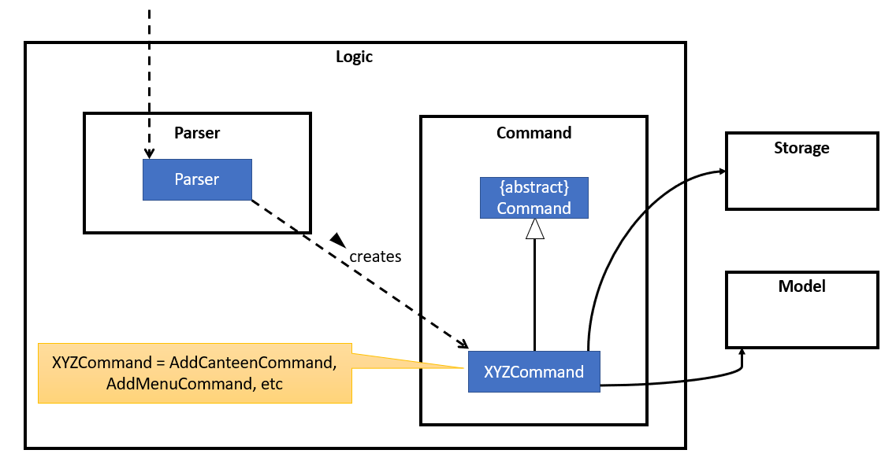
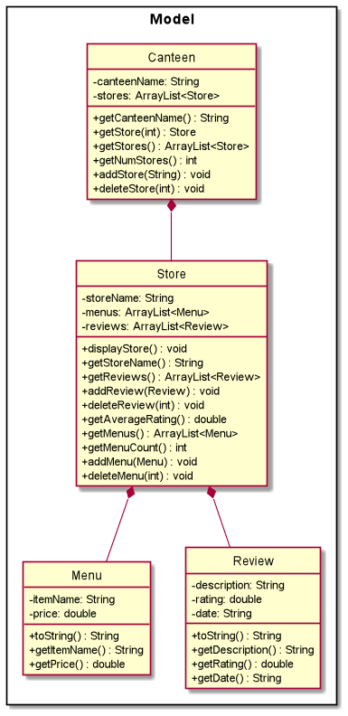
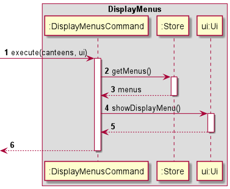
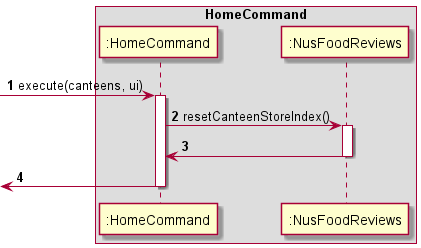
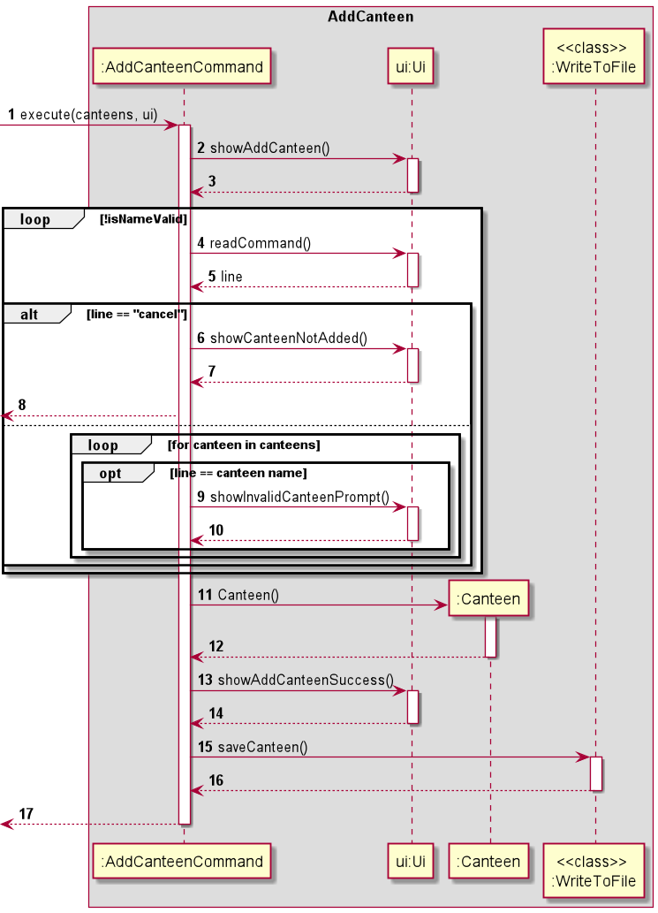

# Developer Guide 

## Table of Contents
* [Setup](#setup)
    * [Prerequisites](#prerequisites)
    * [Get Started](#getting-started)
* [Design](#design)
    * [Project Overview](#project-overview)
    * [Architecture](#architecture)
    * [UI Component](#ui-component)
    * [Logic Component](#logic-component)
    * [Model Component](#model-component)
    * [Storage Component](#storage-component)

## **Setup**
### Prerequisites
+ *JDK `11`* or beyond.
+ Permission rights to create a file and folder in your machine.
+ At least 10Mb of free space on disk.

### Getting-started
1. Fork this repo and clone it into your computer.
2. Run Intellij as your IDE (Highly Recommended).
3. Configure the JDK to JDK 11.
4. Make sure you have added the following plugins, if disabled please re-enable it back by going to `File`>`Settings`>`Plugins`.
   
5. Import the project as a Gradle project by selecting build.gradle. 
6. Verify the setup: Run the nusfoodreviews and test a few commands. 
7. Run the gradle Checks and Tests to ensure they all pass.

## **Design**
### Project-Overview
NusFoodReviews is a application that is built using Java. It has cross-platform ability and is able to run on MAC-OS, 
Windows and Linux. When run, NusFoodReviews allows user to view selected canteens, stores with their menus, reviews and ratings. In addition,
user is able to leave reviews and ratings to the stores. On the other hand the user can choose to run as admin, and the
password is `Password`. When run as admin the user is able to `add` or `remove` canteens, stores, menu and reviews. These admin
functions allows the app to be moderated and maintained by the person in charge. 

### Architecture

The Architecture Diagram shown above explains the high-level design of NusFoodReviews Application. The following is a brief overview of each component.

*Main* is responsible for,
+ At app launch: Initializes the components in the correct sequence, and connects them up with each other.
+ At shut down: Shuts down the components and invokes cleanup methods where necessary.

*Commons* represents a collection of classes used by multiple other components.
  

  
The rest of the App consists of four components.
* [**`UI`**](#ui-component): The UI of the App. 
* [**`Logic`**](#logic-component): The command executor.
* [**`Model`**](#model-component): Holds the data of the In-App memory.
* [**`Storage`**](#storage-component): Reads data from text file, and write to text file. 

### UI-Component

### Logic-Component

API: `NusFoodReviews.java`
1. `NusFoodReviews` uses the `Parser` class to parse the user command.
2. A `Command` object will be created and executed by the `NusFoodReviews`
3. The command execution can affect `Model`, the component that holds 
   data of the In-App memory (e.g. adding a canteen).
4. In Addition, the command execution can interact with `Ui` to interact 
   with the user, such as requesting for inputs

### Model-Component

Our model consists of four classes: Canteen, Store, Menu, and Review.
Composition relationships exist between these classes. 
For example, when a Canteen is deleted, all Stores, Menus and Reviews will also be deleted.

### Storage-Component

## Implementation
For public users, the list of commands is shown below:

* Display selected store sample menu: `menu`
* Display all reviews of the selected store : `reviews`
* Add a new review of the selected store: `add`
* Display all the stores of the selected canteen: `list`
* Return to home page to select canteen: `home`
* Return to Login Page: `login`
* Exiting the application: `exit`

For admin, the list of commands is shown below:
 0. Exit
 1. View canteens
 2. Add canteen
 3. Add a store in canteen
 4. Add Menu to a store
 5. Delete canteen
 6. Delete a store in canteen
 7. Delete reviews in a store
 8. Delete menu in a store
 9. View stores in a canteen

### Main NusFoodReviews

#### Implementation

When the application is launched, a Ui object and Parser object is instantiated.
To instantiate the Parser object, the main NusFoodReviews and Ui object is passed.

### [Public user] Display Menus Feature
#### Implementation

To display menus, `DisplayMenusCommand.execute()` is called, passing in
an ArrayList of canteens and the Ui object instantiated in NusFoodReviews.

When DisplayMenusCommand was first instantiated, the relevant Store object was passed 
into the constructor. `DisplayMenusCommand.execute()` will then call `getMenus()` on the 
store object to get an ArrayList of menus, before passing the ArrayList to the ui object 
to be displayed by calling `Ui#showDisplayMenu()`.

###[Public user] Read reviews feature
#### Implementation

To read reviews, `ReadReviewsCommand.execute()` is called passing in an ArrayList of
canteens and the Ui object instantiated in nusFoodReviews.

When ReadReviewsCommand was first instantiated, the relevant Store object was passed
into the constructor. `ReadReviewsCommand.execute()` will then call `getReviews()` on the
store object to get an ArrayList of reviews, then calling `getAverageRating()` to get the 
average rating of the store. After that, `getStoreName()` is also called to get the store
name of the store. These parameters are then passed to the ui object to be displayed by calling 
`Ui.showReviews()`

### Reset Store Feature
#### Implementation

To reset the store index in nusFoodReviews, `ResetStoreCommand#execute()` is called, 
passing in an ArrayList of canteens, and the ui object instantiated in NusFoodReviews.

When `ResetStoreCommand` is first called, we pass the main NusFoodReviews object to the 
constructor. This allows the `Command` to interact with the main object when `execute` is called.

### Home Feature
#### Implementation

To reset the store and canteen index in nusFoodReviews, `HomeCommand#execute()` is called,
passing in an ArrayList of canteens, and the ui object instantiated in NusFoodReviews.

When `HomeCommand` is first called, we pass the main NusFoodReviews object to the
constructor. This allows the `Command` to interact with the main object when `execute` is called.

### Admin Capabilities
#### Implementation

Once admin is verified in NusFoodReviews, `Parser#parseAdminCommand()` is called.
A switch class is then used to determine the command to instantiate.
To add a new canteen, the user must enter '2'.

<!--can someone add switch case and separate refs for each switch case maybe-->

### [Admin] Add Canteen
#### Implementation

To add a canteen, `AddCanteenCommand#execute()` is called, passing in
an ArrayList of canteens and the Ui object instantiated in NusFoodReviews.

`Ui#showAddCanteen()` is called to display the add canteen prompt.
The program will then wait for user input, looping continuously if a valid Canteen name is not entered.
Invalid names include: existing canteen names.
If the user inputs 'cancel', the loop is exited and the program returns from `AddCanteenCommand`.

Once a valid CanteenName is entered, a new Canteen object is instantiated and added to the ArrayList of canteens.
`Ui#showAddCanteenSuccess()` is then called to display canteen added confirmation.

Additionally, the static method `Storage#saveCanteen()` is called to update the canteen in storage.

### [Admin] Delete Canteen
#### Implementation

To delete a canteen, `DeleteCanteenCommand#execute()` is called, passing in
an ArrayList of canteens and the Ui object instantiated in NusFoodReviews.

The program first checks if the ArrayList of canteens has more than 0 canteens.
If there are, the program will continue with the canteen deletion process. 
If there are no canteens yet, a short message is printed and the program returns from `DeleteCanteenCommand`.

The remaining canteen deletion process is as follows: 
`Ui#showDisplaySelectCanteens()` is first called to display canteens for the user to select.
The program waits for user input with`Ui#readCommand()`. If the input is 'cancel', 
`Ui#showCanteenNotDeleted()` is called and the program returns from `DeleteCanteenCommand`.
Otherwise, `Parser#parseInt()` is called to check if the user input is a valid index of the canteens array.
The canteen is then removed from the canteens ArrayList, 
and `Ui#showCanteenDeleted()` is called to display the canteen deleted message.

The static method `Storage#save()` is also called to update the storage.

### [Admin] Add Store
#### Implementation

To add a store, `AddStoreCommand#execute()` is called, passing in
an ArrayList of canteens and the Ui object instantiated in NusFoodReviews.

When `AddStoreCommand` is instantiated, the reference to the main program nusFoodReviews is passed.
`NusFoodReviews#setCanteenIndex()` will first be called to prompt the user on which canteen they wish to look at.
The result for this is saved as a private int in `NusFoodReviews`, 
and can be accessed by calling `NusFoodReviews#getCanteenIndex()`.

`Ui#showDisplayStores` and `Ui#showAddCanteen()` is called to display the stores and the add store prompt.
The program will then wait for user input, looping continuously if a valid Store name is not entered.
Invalid names include: existing store names.
If the user inputs 'cancel', the loop is exited and the program returns from `AddStoreCommand`.

Once a valid StoreName is entered, `Canteen#addStore()` will be called to instantiate the Store object 
and append it to the ArrayList of Stores stored in the relevant Canteen object.
`Ui#printStoreAdded()` is then called to display store added confirmation.

The static method `Storage#saveStore()` is also called to update the store in storage.

### [Admin] Delete Stores
#### Implementation

When DeleteStoreCommand was first instantiated, the relevant canteen index 
and store index was passed into the constructor. To delete a store, `DeleteStoreCommand.execute()` 
is called, passing in an ArrayList of canteens and the Ui object instantiated in 
NusFoodReviews.`DeleteStoreCommand.execute()`will then call `get(canteenIndex)` on the canteen object 
to get the current Canteen before calling deleteStore(storeIndex) to delete the store.

### [Admin] Delete Reviews
#### Implementation

When DeleteReviewCommand was first instantiated, the relevant canteen index, review,
and store index was passed into the constructor. To delete a review, `DeleteReviewCommand.execute()`
is called, passing in an ArrayList of canteens and the Ui object instantiated in
NusFoodReviews.`DeleteReviewCommand.execute()`will then call `get(canteenIndex)` on the canteen object
to get the current Canteen before calling getStore(storeIndex) to get current Store. After that, deleteReview(review)
is called on the store object. Ui.reviewDeleted() displays a message to show that the review was deleted.

## Product scope
### Target user profile

{Describe the target user profile}
The target user would be NUS students/staffs who wish 
to get updated reviews about the food places in NUS.

### Value proposition

{Describe the value proposition: what problem does it solve?}
By consolidating food reviews from NUS canteens from students/staffs, 
it aims to allow new students/staffs to have a better experience at these food stores.

## User Stories

|Version| As a ... | I want to ... | So that I can ...|
|--------|----------|---------------|------------------|
|v1.0|user|see list of stores|to find good food|
|v1.0|user|read reviews|decide on where to eat|
|v1.0|user|view menu and price of items|know the type of food sold|
|v1.0|user|add reviews and rating|provide feedback on store|
|v1.0|admin|login|verify myself|
|v2.0|admin|add a new canteen 
|v2.0|admin|delete an existing canteen
|v2.0|admin|delete a store|update availability of stores
|v2.0|admin|delete a review|restrict inappropriate reviews

## Non-Functional Requirements

{Give non-functional requirements}

## Glossary

* *glossary item* - Definition

## Instructions for manual testing

{Give instructions on how to do a manual product testing e.g., how to load sample data to be used for testing}
