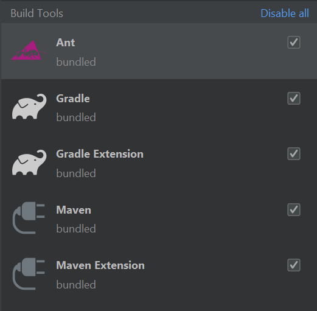
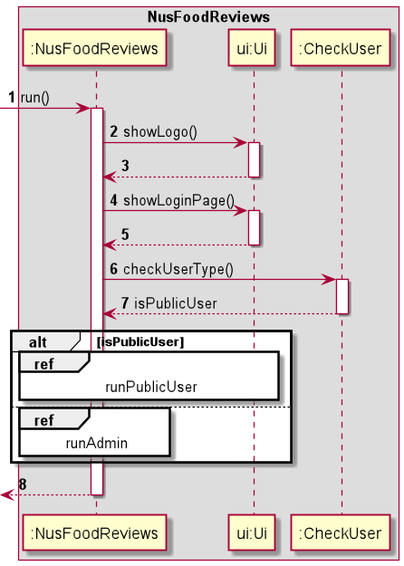
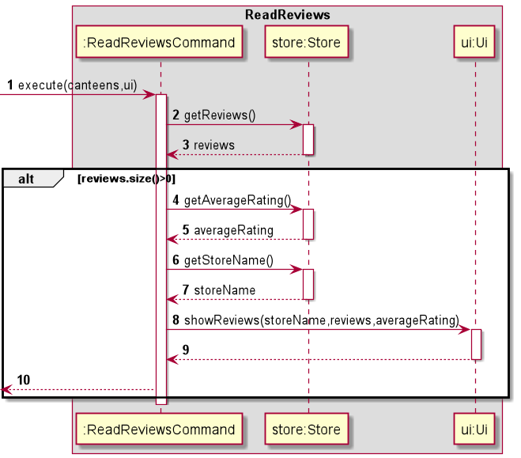
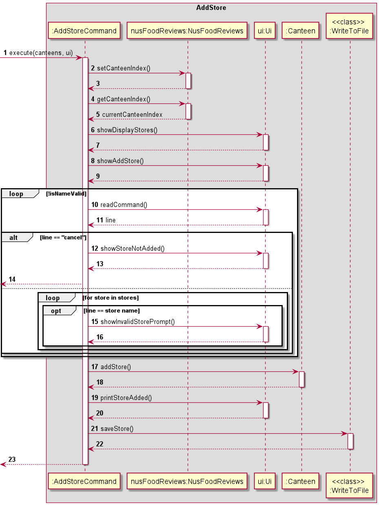

# Developer Guide 

## Table of Contents
* [Setup](#setup)
    * [Prerequisites](#prerequisites)
    * [Get Started](#getting-started)
* [Design](#design)
    * [Project Overview](#project-overview)
    * [Architecture](#architecture)
    * [UI Component](#ui-component)
    * [Logic Component](#logic-component)
    * [Model Component](#model-component)
    * [Storage Component](#storage-component)

## **Setup**
### Prerequisites
+ *JDK `11`* or beyond.
+ Permission rights to create a file and folder in your machine.
+ At least 10Mb of free space on disk.

### Getting-started
1. Fork this repo and clone it into your computer.
2. Run Intellij as your IDE (Highly Recommended).
3. Configure the JDK to JDK 11.
4. Make sure you have added the following plugins, if disable please re-enable it back by going to `File`>`Settings`>`Plugins`.
   
5. Import the project as a Gradle project by selecting build.gradle. 
6. Verify the setup: Run the nusfoodreviews and test a few commands. 
7. Run the gradle Checks and Tests to ensure they all pass.

## **Design**
### Project-Overview
NusFoodReviews is a application that is built using Java. It has cross-platform ability and is able to run on MAC-OS, 
Windows and Linux. When run, NusFoodReviews allows user to view selected canteens, stores with their menus, reviews and ratings. In addition,
user is able to leave reviews and ratings to the stores. On the other hand the user can choose to run as admin, and the
password is `Password`. When run as admin the user is able to `add` or `remove` canteens, stores, menu and reviews. These admin
functions allows the app to be moderated and maintained by the person in charge. 

### Architecture

The Architecture Diagram shown above explains the high-level design of NusFoodReviews Application. The following is a brief overview of each component.

`Main` is responsible for,
+ At app launch: Initializes the components in the correct sequence, and connects them up with each other.
+ At shut down: Shuts down the components and invokes cleanup methods where necessary.

`Resources` contains the bundled resource(database file) of the application. When user run the application for the first time, 
it will read from this resource and copy it to the local machine. Return user will not need to read from this resource anymore. 

`Commons` represents a collection of classes used by multiple other components.
  

  
The rest of the App consists of four components.
* [**`UI`**](#ui-component): The UI of the App. 
* [**`Logic`**](#logic-component): The command executor.
* [**`Model`**](#model-component): Holds the data of the In-App memory.
* [**`Storage`**](#storage-component): Reads data from text file, and write to text file. 

### UI-Component

### Logic-Component

### Model-Component

### Storage-Component

The `Storage` component,
* For new user, will first create a new directory and text file.
* Next, will load the data from resource and store it into the newly created text file.
* At the same time, it will also load into the in-app data.
* If it is an existing user, it will only loads data from the text file into in-App data.  

##Implementation
For public users, the list of commands is shown below:

* Display selected store sample menu: `menu`
* Display all reviews of the selected store : `reviews`
* Add a new review of the selected store: `add`
* Goes back to home page to select canteen: `home`
* Display all the stores of the selected canteen: `list`
* Exiting the application: `exit`

For admin, the list of commands is shown below:

 1. View canteens
 2. Add canteen
 3. Add store in canteen
 4. Delete canteen
 5. Delete store in canteen
 6. Delete reviews
 7. Exit

<!-- NOT TOO SURE HOW THIS PART FITS IN

#### Sequence Diagram for `admin`
When the user enters `2` to go into the admin page, the AdminVerification() is called. It will ask the user to input 
the password. Then it will check the input against the set password. If fails then the user have to enter again or enter
`exit` to exit the application.
--> 

### Main NusFoodReviews

#### Implementation

When the application is launched, a Ui object and Parser object is instantiated.
To instantiate the Parser object, the main NusFoodReviews and Ui object is passed.

### [Public user] Display Menus Feature
#### Implementation

To display menus, `DisplayMenusCommand.execute()` is called, passing in
an ArrayList of canteens and the Ui object instantiated in NusFoodReviews.

When DisplayMenusCommand was first instantiated, the relevant Store object was passed 
into the constructor. `DisplayMenusCommand.execute()` will then call `getMenus()` on the 
store object to get an ArrayList of menus, before passing the ArrayList to the ui object 
to be displayed by calling `Ui#showDisplayMenu()`.

###[Public user] Read reviews feature
#### Implementation

To read reviews, `ReadReviewsCommand.execute()` is called passing in an ArrayList of
canteens and the Ui object instantiated in nusFoodReviews.

When ReadReviewsCommand was first instantiated, the relevant Store object was passed
into the constructor. `ReadReviewsCommand.execute()` will then call `getReviews()` on the
store object to get an ArrayList of reviews, then calling `getAverageRating()` to get the 
average rating of the store. After that, `getStoreName()` is also called to get the store
name of the store. These parameters are then passed to the ui object to be displayed by calling 
`Ui.showReviews()`

### Reset Store Feature
#### Implementation

To reset the store index in nusFoodReviews, `ResetStoreCommand#execute()` is called, 
passing in an ArrayList of canteens, and the ui object instantiated in NusFoodReviews.

When `ResetStoreCommand` is first called, we pass the main NusFoodReviews object to the 
constructor. This allows the `Command` to interact with the main object when `execute` is called.

### Home Feature
#### Implementation

To reset the store and canteen index in nusFoodReviews, `HomeCommand#execute()` is called,
passing in an ArrayList of canteens, and the ui object instantiated in NusFoodReviews.

When `HomeCommand` is first called, we pass the main NusFoodReviews object to the
constructor. This allows the `Command` to interact with the main object when `execute` is called.

### Admin Capabilities
#### Implementation

Once admin is verified in NusFoodReviews, `Parser#parseAdminCommand()` is called.
A switch class is then used to determine the command to instantiate.
To add a new canteen, the user must enter '2'.

<!--can someone add switch case and separate refs for each switch case maybe-->

### [Admin] Add Canteen
#### Implementation

<!--this part should be in the switchcase ref-->
`Ui#showAddCanteen()` is called to display the add canteen prompt.
User input for canteen name will then be read using `Ui#readCommand()`.
A new AddCanteenCommand object is instantiated, with the canteen name passed into the constructor.
`Parser#parseAdminCommand()` returns the AddCanteenCommand object.
<!--this part should be in the switchcase ref-->

To add a canteen, `AddCanteenCommand#execute()` is called, passing in 
an ArrayList of canteens and the Ui object instantiated in NusFoodReviews.

A new Canteen object is then instantiated, and added to the ArrayList of canteens.
`Ui#showAddCanteenSuccess()` is called to display canteen added confirmation.

### [Admin] Add Store
#### Implementation

To add a store, `AddStoreCommand#execute()` is called, passing in
an ArrayList of canteens and the Ui object instantiated in NusFoodReviews.

A new Store object is then instantiated, and added to the Canteen's ArrayList of stores.
`Ui#printStoreAdded()` is called to display store added confirmation.

### [Admin] Delete Canteen
#### Implementation

To delete a canteen, `DeleteCanteenCommand#execute()` is called, passing in
an ArrayList of canteens and the Ui object instantiated in NusFoodReviews.

The canteen object is removed from the canteens ArrayList. 
`Ui#showCanteenDeleted()` is called to display the canteen deleted message.

### [Admin] Delete Stores
#### Implementation

When DeleteStoreCommand was first instantiated, the relevant canteen index 
and store index was passed into the constructor. To delete a store, `DeleteStoreCommand.execute()` 
is called, passing in an ArrayList of canteens and the Ui object instantiated in 
NusFoodReviews.`DeleteStoreCommand.execute()`will then call `get(canteenIndex)` on the canteen object 
to get the current Canteen before calling deleteStore(storeIndex) to delete the store.

### [Admin] Delete Reviews
#### Implementation

When DeleteReviewCommand was first instantiated, the relevant canteen index, review,
and store index was passed into the constructor. To delete a review, `DeleteReviewCommand.execute()`
is called, passing in an ArrayList of canteens and the Ui object instantiated in
NusFoodReviews.`DeleteReviewCommand.execute()`will then call `get(canteenIndex)` on the canteen object
to get the current Canteen before calling getStore(storeIndex) to get current Store. After that, deleteReview(review)
is called on the store object. Ui.reviewDeleted() displays a message to show that the review was deleted.

## Product scope
### Target user profile

{Describe the target user profile}
The target user would be NUS students/staffs who wish 
to get updated reviews about the food places in NUS.

### Value proposition

{Describe the value proposition: what problem does it solve?}
By consolidating food reviews from NUS canteens from students/staffs, 
it aims to allow new students/staffs to have a better experience at these food stores.

## User Stories

|Version| As a ... | I want to ... | So that I can ...|
|--------|----------|---------------|------------------|
|v1.0|user|see list of stores|to find good food|
|v1.0|user|read reviews|decide on where to eat|
|v1.0|user|view menu and price of items|know the type of food sold|
|v1.0|user|add reviews and rating|provide feedback on store|
|v1.0|admin|login|verify myself|
|v2.0|admin|add a new canteen 
|v2.0|admin|delete an existing canteen
|v2.0|admin|delete a store|update availability of stores
|v2.0|admin|delete a review|restrict inappropriate reviews

## Non-Functional Requirements

{Give non-functional requirements}

## Glossary

* *glossary item* - Definition

## Instructions for manual testing

{Give instructions on how to do a manual product testing e.g., how to load sample data to be used for testing}
