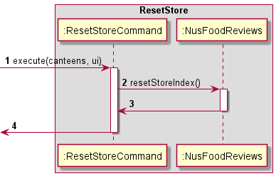
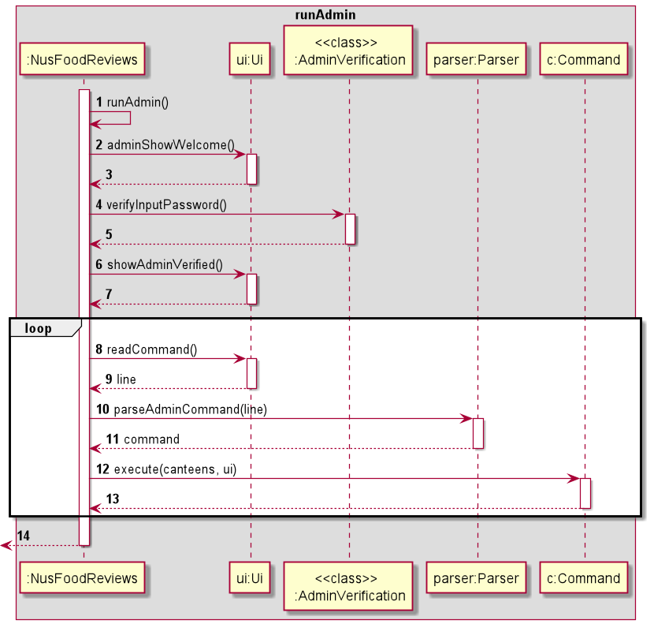
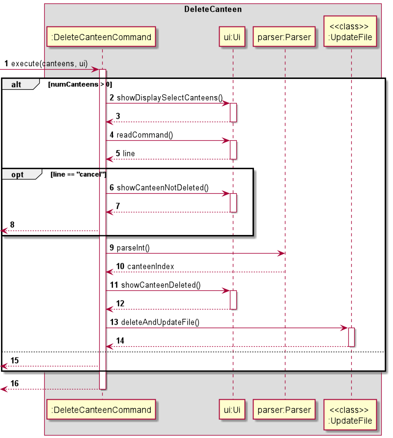

# Developer Guide

## Design 

### Project overview

NUSFOODREVIEW is built using java. It has cross platform ability that allows it to run on Windows, MAC-OS and Linux. 
When the application is running it has to ability to display a number of canteens around NUS and all their stores available.
The application allow users to read/enter reviews and ratings on the chosen store. User is also able to view some sample 
menus of the stores. The application will record the timestamp whenever a new review is entered and print it out together 
with the review when requested. Admin must verify themselves using password given by the application developer and change 
it once they logged in as admin. Admin has the ability to add/delete canteen, store and review. NUSFOODREVIEW has a storage file
that allows the saving and loading of data. This allows all parameters of the data to be stored and read whenever is needed.

## Implementation
Below is the list of commands available.

* Display selected store sample menu: `menu`
* Display all reviews of the selected store : `reviews`
* Add a new review of the selected store: `add`
* Goes back to home page to select canteen: `home`
* Display all the stores of the selected canteen: `list`
* Exiting the application: `exit`

<!-- NOT TOO SURE HOW THIS PART FITS IN
#### Sequence Diagram for `admin`
When the user enters `2` to go into the admin page, the AdminVerification() is called. It will ask the user to input 
the password. Then it will check the input against the set password. If fails then the user have to enter again or enter
`exit` to exit the application.

### [Proposed] delete feature 
#### Proposed Implementation
Step 1. The admin launches the application for the first time. Admin must enter a password to verify identity.

Step 2. The user selects to delete a canteen from the list of tasks admin can do.

Step 3. The user selects a canteen from the canteen list and canteen is deleted.

--> 

### Main NusFoodReviews
#### Implementation

When the application is launched, a Ui object and Parser object is instantiated.
To instantiate the Parser object, the main NusFoodReviews and Ui object is passed.

### Display Menus Feature
#### Implementation

To display menus, `DisplayMenusCommand#execute()` is called, passing in
an ArrayList of canteens and the Ui object instantiated in NusFoodReviews.

When DisplayMenusCommand was first instantiated, the relevant Store object was passed 
into the constructor. `DisplayMenusCommand#execute()` will then call `getMenus()` on the 
store object to get an ArrayList of menus, before passing the ArrayList to the ui object 
to be displayed by calling `Ui#showDisplayMenu()`

### Reset Store Feature
#### Implementation

To reset the store index in nusFoodReviews, `ResetStoreCommand#execute()` is called, 
passing in an ArrayList of canteens, and the ui object instantiated in NusFoodReviews.

When `ResetStoreCommand` is first called, we pass the main NusFoodReviews object to the 
constructor. This allows the `Command` to interact with the main object when `execute` is called.

### Home Feature
#### Implementation

To reset the store and canteen index in nusFoodReviews, `HomeCommand#execute()` is called,
passing in an ArrayList of canteens, and the ui object instantiated in NusFoodReviews.

When `HomeCommand` is first called, we pass the main NusFoodReviews object to the
constructor. This allows the `Command` to interact with the main object when `execute` is called.

### Admin Capabilities
#### Implementation

Once admin is verified in NusFoodReviews, `Parser#parseAdminCommand()` is called.
A switch class is then used to determine the command to instantiate.
To add a new canteen, the user must enter '2'.

<!--can someone add switch case and separate refs for each switch case maybe-->

### [Admin] Add Canteen
#### Implementation

<!--this part should be in the switchcase ref-->
`Ui#showAddCanteen()` is called to display the add canteen prompt.
User input for canteen name will then be read using `Ui#readCommand()`.
A new AddCanteenCommand object is instantiated, with the canteen name passed into the constructor.
`Parser#parseAdminCommand()` returns the AddCanteenCommand object.
<!--this part should be in the switchcase ref-->

To add a canteen, `AddCanteenCommand#execute()` is called, passing in 
an ArrayList of canteens and the Ui object instantiated in NusFoodReviews.

A new Canteen object is then instantiated, and added to the ArrayList of canteens.
`Ui#showAddCanteenSuccess()` is called to display canteen added confirmation.

### [Admin] Delete Canteen
#### Implementation

To delete a canteen, `DeleteCanteenCommand#execute()` is called, passing in
an ArrayList of canteens and the Ui object instantiated in NusFoodReviews.

The canteen object is removed from the canteens ArrayList. 
`Ui#showCanteenDeleted()` is called to display the canteen deleted message.

## Product scope
### Target user profile

{Describe the target user profile}
The target user would be NUS students/staffs who wish 
to get updated reviews about the food places in NUS.

### Value proposition

{Describe the value proposition: what problem does it solve?}
By consolidating food reviews from NUS canteens from students/staffs, 
it aims to allow new students/staffs to have a better experience at these food stores.

## User Stories

|Version| As a ... | I want to ... | So that I can ...|
|--------|----------|---------------|------------------|
|v1.0|user|see list of stores|to find good food|
|v1.0|user|read reviews|decide on where to eat|
|v1.0|user|view menu and price of items|know the type of food sold|
|v1.0|user|add reviews and rating|provide feedback on store|
|v1.0|admin|login|verify myself|
|v2.0|admin|add a new canteen
|v2.0|admin|delete an existing canteen

## Non-Functional Requirements

{Give non-functional requirements}

## Glossary

* *glossary item* - Definition

## Instructions for manual testing

{Give instructions on how to do a manual product testing e.g., how to load sample data to be used for testing}
